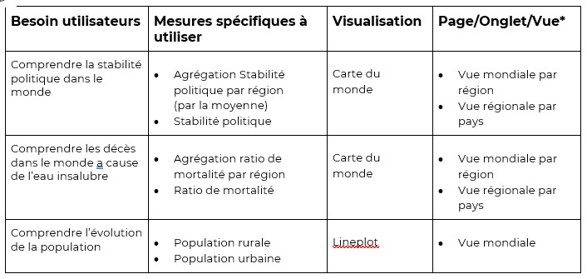

# Etude sur l'eau potable

## Objectif
Identifier les pays présentant des difficultés d'accès à l'eau potable et déterminer ceux pour lesquels une intervention est la plus pertinente au regard des indicateurs disponibles

---

## Travail réalisé
- Analyse du besoin métier et définition des indicateurs de suivi
- 
- Contrôle qualité et préparation des données
- Analyse exploratoire des données (EDA)
- Analyse comparative des pays selon plusieurs indicateurs d'accès à l'eau potable
- Conception de tableaux de bord interactifs sous Tableau
- Création d'une histoire Tableau pour faciliter la prise de décision
- Data visualisation et storytelling
- Identification des pays prioritaires d'intervention
- Formulation de recommandations stratégiques pour l'allocation des financements

---

## Outils
- Tableau Desktop
- Tableau Public
- Excel / CSV

---

## Résultats
- Création d'un tableau de bord interactif structuré en 3 niveaux d'analyse :
  - Vue mondiale
  - Vue régionale
  - Vue nationale
- Identification des pays présentant les plus fortes difficultés d'accès à l'eau potable
- Aide à la priorisation des interventions de l'ONG selon différents indicateurs socio-économiques et sanitaires

---

## Documents
- Présentation (presentation_eau_potable.pdf)
- Dashboard interactif Tableau Public : https://public.tableau.com/shared/YN6CDCPSJ?:display_count=n&:origin=viz_share_link

---

## Auteur
Yoann De Cler
